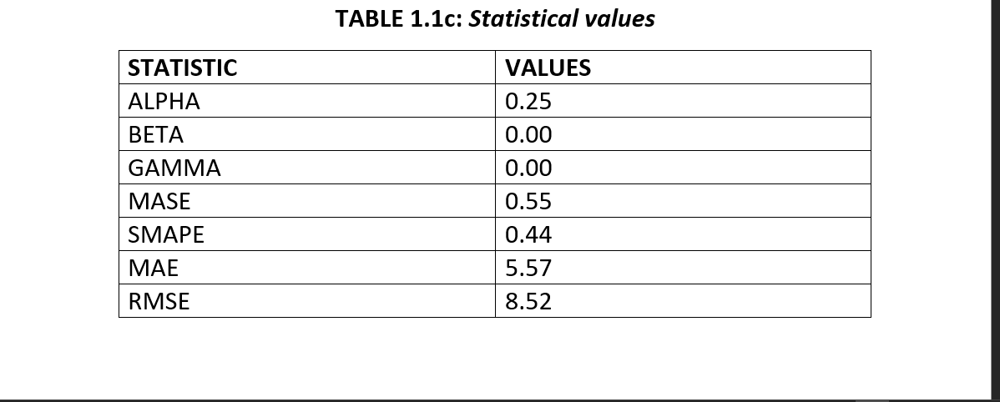
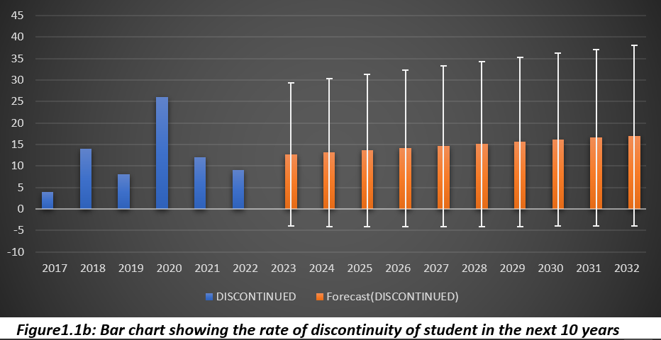
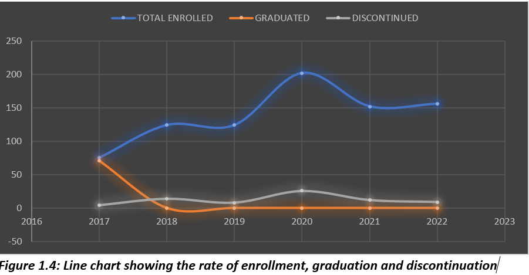

# Time Series Analysis

## Introduction

This is a project that tries to predicts students graduation and attrition rate from the department of Petroleum and Gas Engineering  in the University of Port-Harcourt  for the next 10 years

## Problem Statement

 In face of the growing difficulty in getting employed after college are most students still willing to pursue their dreams of acquiring a degree or are they forced to seek other means of making ends meet?

## Skills/Concept demonstrated

-	Time series analysis 
-	Statistical analysis
-	Excel forecast sheet

## Data Sourcing
  
   The data used were gotten directly from the  institution studied in this report. It includes column headers such as: year, number of student enrolled, number of graduated students,       number of discontinued students.

  ## Data Cleaning 

   Some of the data provided were omitted/deleted in this analysis mainly because just a year of the data was gotten from the institution and would therefore add little to no         
   significance to the overall analysis.

  ## Visualizations 

  

-----
   

------
   
  

  

  ## Analysis
  The observation made upon completion of this project was that the dropout rate is having an upward trend and its being forecasted to go higher and later flatten out in coming years.
 ## _NB:_
  The type of forecasting technique used was the exponential smoothing forecasting technique.

  ## Conclusion/Recommendation

  This goal of the report was to bring to light the fact that over the years some students have tend to not finish their programs(Petroluem and Gas Engineering)  and that the numbers might increase in coming years. Hence, there is need to start paying closer attention to issues like this.

## If I had more time

Would have loved to carry out the forecasting usimg other techniques such as:
- Naive method
- Holt's method
- Moving point Average etc.
  
