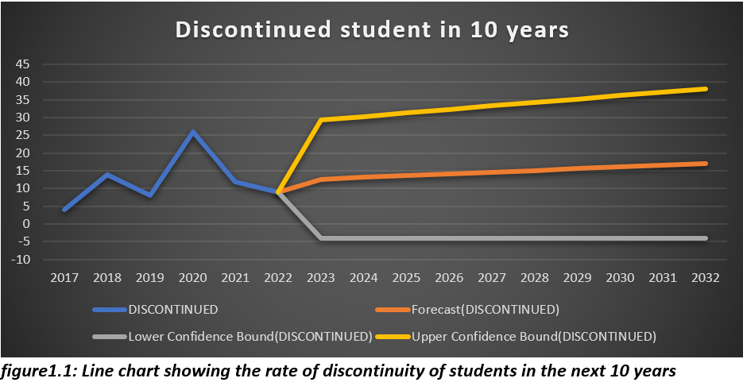

# Time Series Analysis

## Introduction

This is a project that tries to predicts students graduation and attrition rate from the department of Petroleum and Gas Engineering  in the University of Port-Harcourt  for the next 10 years

## Problem Statement

 In face of the growing difficulty in getting employed after college are most students still willing to pursue their dreams of acquiring a degree or are they forced to seek other means of making ends meet?

## Skills/Concept demonstrated

-	Time series analysis 
-	Statistical analysis
-	Excel forecast sheet

## Data Sourcing
  
   The data used were gotten directly from the  institution studied in this report. It includes column headers such as: year, number of student enrolled, number of graduated students,       number of discontinued students.

  ## Data Cleaning 

   Some of the data provided were omitted/deleted in this analysis mainly because just a year of the data was gotten from the institution and would therefore add little to no         
   significance to the overall analysis.

  ## Visualizations 

  
